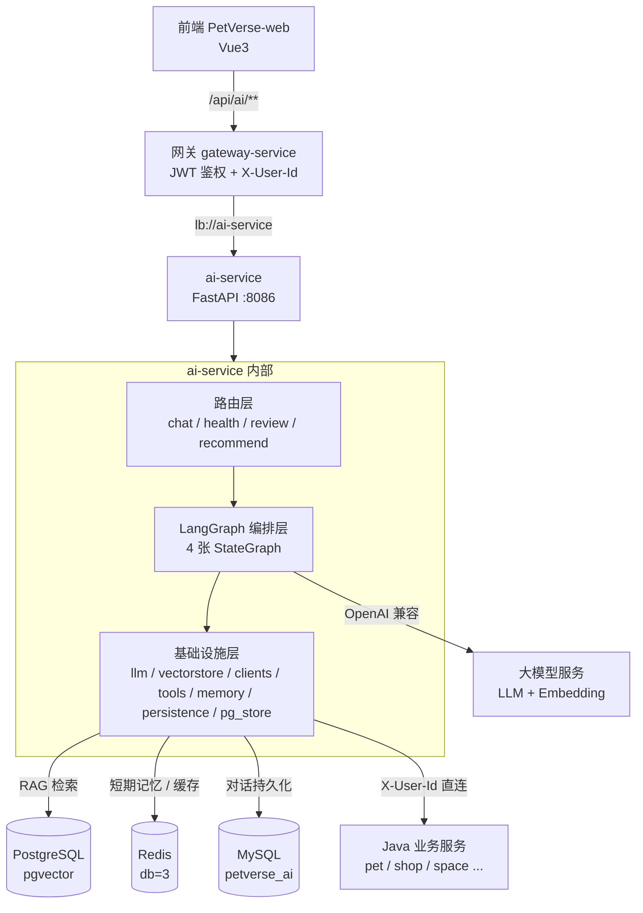
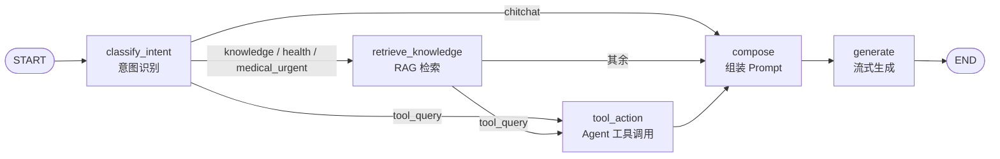
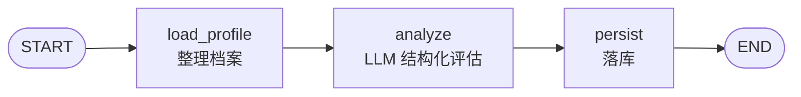
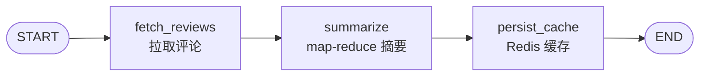
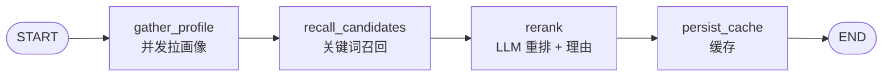

# PetVerse AI 模块功能说明

> 版本：v1.0 ｜ 对应服务：`ai-service`（Python FastAPI）｜ 编排框架：LangChain + LangGraph

本文档介绍 PetVerse 项目 AI 模块的整体架构、四大核心能力、LangGraph 编排细节、RAG 知识库、存储设计、容错降级策略与接入方式，供开发、联调与验收参考。

---

## 一、模块定位

PetVerse AI 模块是一个**独立的 Python AI 微服务**（`ai-service`），以 FastAPI 构建，启动后注册进 Nacos，由 Spring Cloud Gateway 通过 `lb://ai-service` 统一路由，对外仅暴露网关前缀 `/api/ai/**`（StripPrefix=1）。

它承担园区内所有 AI 能力：**养宠顾问对话、宠物健康智能评估、商品评论摘要、个性化推荐**，全部由 **LangGraph** 显式编排，对话与 Embedding 均采用 **OpenAI 兼容协议**，切换模型服务商无需改代码。

### 为什么独立成 Python 服务

| 考量 | 说明 |
|---|---|
| 生态 | LangChain / LangGraph 生态在 Python 侧最完整，Agent、结构化输出、向量库集成成熟 |
| 隔离 | AI 依赖重、迭代快，独立服务避免污染 Java 业务模块的构建与依赖 |
| 复用 | 通过 Nacos 服务发现与网关鉴权，完全复用现有微服务体系，不新增网关配置 |

### 与 Java 微服务的关系

- **不修改任何 Java 代码**：ai-service 通过 `httpx` 直连各业务服务拉取上下文，注入内部请求头 `X-User-Id`；Java 侧 `UserContextInterceptor` 在无 JWT 时信任该内部头（外部请求的该头已被网关剥离），天然具备用户隔离。
- 所有新接口都落在 `/api/ai/**` 下，网关路由无需改动。

---

## 二、技术栈

| 层次 | 技术 | 用途 |
|---|---|---|
| Web 框架 | FastAPI + Uvicorn | HTTP / SSE 接口 |
| 编排引擎 | **LangGraph** | 四张状态图（对话 / 健康 / 摘要 / 推荐） |
| LLM 框架 | **LangChain**（v1）+ langchain-openai | 模型调用、结构化输出、工具、RAG |
| 对话模型 | OpenAI 兼容（DeepSeek / 阿里云百炼等） | 可配 `base_url` + `model` |
| Embedding | OpenAI 兼容 | RAG 向量化 |
| 向量库 | PostgreSQL + **pgvector** | 语义检索 |
| 短期记忆 | Redis（db=3） | LLM 上下文缓存 + 结果缓存 |
| 对话持久化 | MySQL（`petverse_ai`） | 会话与消息 |
| 结果持久化 | PostgreSQL（`petverse_ai`） | 健康报告 + 缓存兜底 |
| 服务发现 | Nacos | 注册为 `ai-service` |

---

## 三、整体架构



### 目录结构

```
ai-service/
├── app/
│   ├── main.py              # FastAPI 入口 + lifespan（Redis/MySQL/PG/Nacos）
│   ├── config.py            # pydantic-settings 配置中心
│   ├── llm.py               # LLM / Embedding 客户端 + 结构化输出助手
│   ├── vectorstore.py       # pgvector 检索 + 关键词降级
│   ├── clients.py           # 业务微服务 HTTP 客户端
│   ├── tools.py             # LangGraph Agent 工具集
│   ├── memory.py            # Redis 短期记忆 + 通用缓存
│   ├── persistence.py       # MySQL 会话/消息持久化
│   ├── pg_store.py          # PostgreSQL 健康报告 + 缓存
│   ├── persona.py           # 系统提示词组装
│   ├── schemas.py           # 数据模型 + 结构化输出 Schema
│   ├── chat.py              # 对话路由（SSE）
│   ├── health.py            # 健康评估路由
│   ├── review.py            # 评论摘要路由
│   ├── recommend.py         # 个性化推荐路由
│   ├── graph/               # 四张 LangGraph 编排图
│   ├── knowledge/           # RAG 知识库 Markdown 语料
│   └── logging_setup.py     # 统一日志
├── scripts/ingest_knowledge.py   # 知识库导入脚本
├── db/
│   ├── schema.sql                # MySQL 表
│   └── schema_pgvector.sql       # PostgreSQL + pgvector 表
└── requirements.txt
```

---

## 四、核心能力

| 能力 | 网关接口 | 编排图 | 存储 |
|---|---|---|---|
| AI 养宠顾问对话 | `POST /api/ai/chat/stream`（SSE） | `chat_graph` | Redis + MySQL |
| 会话历史 / 列表 / 删除 | `GET/DELETE /api/ai/chat/*` | — | Redis + MySQL |
| AI 健康智能评估 | `POST /api/ai/health/assess` | `health_graph` | PostgreSQL |
| 健康评估历史 | `GET /api/ai/health/history` | — | PostgreSQL |
| 商品评论摘要 | `POST /api/ai/shop/review/summary` | `review_graph` | Redis 缓存 |
| 个性化推荐 | `GET /api/ai/recommend/feed` | `recommend_graph` | Redis 缓存 |

---

## 五、LangGraph 编排详解

### 5.1 对话编排（chat_graph）

一条消息进入后，先**意图识别**，再按意图走不同分支，最后统一组装 Prompt 并流式生成：



**五类意图**：

| 意图 | 含义 | 处理 |
|---|---|---|
| `chitchat` | 打招呼、闲聊 | 跳过检索与工具，直接生成 |
| `knowledge` | 养宠知识咨询 | 走 RAG 检索知识库 |
| `health` | 健康评估、体检、养护 | 走 RAG 检索 |
| `medical_urgent` | 疑似疾病、用药、急症 | 走 RAG + **强制医疗安全护栏** |
| `tool_query` | 查询用户真实数据 | 走 Agent 工具调用 |

**节点职责**：

- `classify_intent`：真实模式用 LLM 结构化输出分类；mock / 失败时降级为关键词规则（含急症词表：抽搐、中毒、尿闭、误食、车祸等）。
- `retrieve_knowledge`：pgvector 语义检索，带相似度阈值过滤，拼成带来源引用的知识块。
- `tool_action`：`create_agent` + 工具集运行 ReAct，查询用户真实数据。
- `compose`：组装 System Prompt = 人设 + 宠物档案 + 参考知识 + 用户数据 + 医疗护栏。
- `generate`：真实模式调用 LLM；mock 模式由路由层走打字机 mock 流。

**医疗安全护栏**：命中 `medical_urgent` 时，Prompt 强制注入「明确说明无法替代兽医诊断，务必尽快到正规宠物医院就诊，不要仅凭线上建议自行用药」。

**流式实现**：路由层用 `graph.astream(state, stream_mode="messages")`，只透传 `generate` 节点的助手文本增量，保留 token 级流式；前端 SSE 协议保持 `meta → delta* → done` 不变。

### 5.2 健康评估（health_graph）



- `load_profile`：整理宠物档案与健康字段，标记缺失项。
- `analyze`：LLM 结构化输出；mock / 失败时用规则评分（按档案完整度、疫苗驱虫记录、病史关键词扣分）。
- `persist`：写入 `pet_health_report`。

**输出结构**（`PetHealthReport`）：

| 字段 | 说明 |
|---|---|
| `score` | 健康评分 0–100 |
| `level` | `excellent` / `good` / `fair` / `warning` |
| `summary` | 一句话总评 |
| `risks[]` | 风险点 |
| `suggestions[]` | 养护建议 |
| `care_plan[]` | 近期养护计划 |
| `reminders[]` | 疫苗 / 驱虫 / 体检提醒（含紧急度） |
| `disclaimer` | 免责声明 |

**评分标准**：信息完整各项正常 85–100；轻微需改善 70–84；明显风险 50–69；严重/紧急风险 <50。

### 5.3 商品评论摘要（review_graph）



- 先查 Redis 缓存（`ai:review:summary:{productId}`，默认 6 小时）。
- 拉取真实评论 → LLM 结构化摘要；评论为空或 LLM 失败时降级为规则摘要（评分均值定情感、正负词抽句）。
- 输出：`sentiment`（positive/neutral/negative）、`one_line`、`pros[]`、`cons[]`、`keywords[]`、`count`。

### 5.4 个性化推荐（recommend_graph）



- `gather_profile`：并发拉取宠物、订单、购物车、评价、我的动态（任一失败不影响其余）。
- `recall_candidates`：用宠物物种/品种 + 交互商品的名称作为关键词搜索商品，再补热门商品与热门动态，去重规范化。
- `rerank`：LLM 结合画像从候选里挑选并生成推荐理由（限用候选内 id，防幻觉）；失败时启发式排序。
- `persist_cache`：按「用户 + 场景」缓存（默认 10 分钟），`refresh=true` 可跳过。

---

## 六、RAG 知识库

### 双通路检索

1. **语义检索（首选）**：pgvector + OpenAI 兼容 Embedding，余弦距离，理解同义表达。
2. **关键词降级**：未配置 Embedding 或 pgvector 不可用时，直接对内置知识文件做字符 bigram 覆盖度打分，保证零外部依赖也能演示。

两者都受 `RAG_SCORE_THRESHOLD` 影响；关键词通路使用自适应的较低阈值（因为 bigram 分数天然远低于余弦相似度）。

### 知识语料

内置 5 篇 Markdown（`app/knowledge/`）：疫苗与免疫、驱虫、科学喂养、常见疾病与就医信号、行为训练与日常护理。

导入命令：

```powershell
.venv\Scripts\python -m scripts.ingest_knowledge
```

脚本用 `RecursiveCharacterTextSplitter`（中文分隔符优先）切分，**幂等重建**集合后写入 pgvector；未配置 Embedding 时提示跳过。

### 向量库接入

- 集合由 `langchain-postgres.PGVector` 自动管理（`langchain_pg_collection` / `langchain_pg_embedding`），无需手工建表。
- 仅需数据库提前 `CREATE EXTENSION vector`（已含在 `db/schema_pgvector.sql`）。
- **维度必须与 `EMBEDDING_DIM` 一致**（默认 1024），切换模型需重建集合。

---

## 七、存储设计

| 存储 | 内容 | Key / 表 | 生命周期 |
|---|---|---|---|
| Redis db=3 | 对话短期上下文 | `ai:chat:history:{userId}:{sessionId}`（LIST） | 滚动保留最近 N 条 + TTL 7 天 |
| Redis db=3 | 评论摘要缓存 | `ai:review:summary:{productId}` | 6 小时 |
| Redis db=3 | 推荐缓存 | `ai:recommend:{scene}:{userId}` | 10 分钟 |
| MySQL | 会话 | `chat_session`（用户+宠物+会话三级隔离） | 永久 |
| MySQL | 消息 | `chat_message` | 永久 |
| PostgreSQL | 健康报告 | `pet_health_report` | 永久（保留历史） |
| PostgreSQL | 结果缓存兜底 | `ai_cache` | 带过期时间 |

**对话读写一致**：写入时 Redis 与 MySQL 并行；读取历史优先 Redis（快），为空回落 MySQL 最近 N 条；删除会话时同步清理两者。客户端中途断开时，用 `append_if_exists` / `save_turn_if_exists` 做原子兜底保存，避免「复活」已删除的历史。

---

## 八、容错与降级设计

模块的每个外部依赖都有明确的降级路径，**任何单点故障都不会让 AI 主流程报错**：

| 依赖 | 故障表现 | 降级策略 |
|---|---|---|
| LLM API | 超时 / 报错 | 对话：发 `error` 事件；健康 / 摘要 / 推荐：降级为规则逻辑 |
| 结构化输出 | 服务商不支持 json_schema | 自动按 `json_schema → function_calling → json_mode` 探测降级 |
| Embedding | 未配置 / 不可用 | RAG 降级为关键词检索 |
| pgvector | 连接失败 | 60 秒冷却期内直接走关键词检索，避免反复打堆栈 |
| 业务服务 | 未启动 / 超时 | 相应上下文返回空，推荐退化为热门 |
| Redis | 不可用 | 读返回空、写静默失败；历史回落 MySQL |
| MySQL / PG | 不可用 | 会话不可建时回业务错误；消息/报告静默降级 |
| 并发过载 | 信号量 3 秒超时 | 返回 `error` 事件（全局并发上限 20） |

> **关键点**：`structured output` 的跨服务商降级是必须的。例如 DeepSeek 思考模型既不支持 `json_schema` 也不支持 `tool_choice`，若不做降级，意图识别、健康评估、评论摘要、推荐重排会全部**静默退化**为规则逻辑（接口仍返回 200，难以察觉）。

---

## 九、配置说明

配置集中在 `ai-service/.env`，由 `pydantic-settings` 读取。核心项：

| 类别 | 配置项 | 说明 |
|---|---|---|
| 对话模型 | `LLM_API_KEY` / `LLM_BASE_URL` / `LLM_MODEL` | OpenAI 兼容；`LLM_*` 留空时回落 `DEEPSEEK_*` |
| Embedding | `EMBEDDING_API_KEY` / `EMBEDDING_BASE_URL` / `EMBEDDING_MODEL` / `EMBEDDING_DIM` | 不配置则 RAG 关键词降级 |
| 模式 | `MOCK_CHAT` | `true` 走内置模拟回复，无需真实调用 |
| pgvector | `PG_HOST/PORT/USER/PASSWORD/DB` | 向量库与健康报告 |
| RAG | `RAG_ENABLED` / `RAG_TOP_K` / `RAG_SCORE_THRESHOLD` | 检索开关与参数 |
| 业务服务 | `PET_/SPACE_/USER_/SOCIAL_/REMARK_/SHOP_SERVICE_URL` | 直连地址 |
| 缓存 | `REVIEW_SUMMARY_TTL` / `RECOMMEND_CACHE_TTL` | 各能力缓存 TTL |
| 记忆 | `HISTORY_MAX_MESSAGES` / `HISTORY_TTL_SECONDS` | 上下文窗口 |
| 生成 | `LLM_MAX_TOKENS` / `LLM_TEMPERATURE` | 生成参数 |

**服务商切换示例**：

```ini
# DeepSeek
LLM_BASE_URL=https://api.deepseek.com/v1
LLM_MODEL=deepseek-chat

# 阿里云百炼
LLM_BASE_URL=https://dashscope.aliyuncs.com/compatible-mode/v1
LLM_MODEL=qwen-plus
EMBEDDING_BASE_URL=https://dashscope.aliyuncs.com/compatible-mode/v1
EMBEDDING_MODEL=text-embedding-v3
EMBEDDING_DIM=1024
```

---

## 十、接口清单

所有业务响应统一为 HTTP 200 + `{code, msg, data}`，鉴权由网关注入 `X-User-Id`，缺失返回 `401`。

### 10.1 对话

`POST /api/ai/chat/stream` — SSE 流式对话

```json
// 请求体
{ "message": "我家猫该多久驱虫？", "pet": { "id": 1, "name": "咪咪", "species": "猫", "age": 2,
  "health": { "weight": "4.2kg", "vaccine": "已打三联" } }, "sessionId": null }
```

```
// SSE 事件流
data: {"type":"meta","sessionId":123}     // 首帧：会话元信息
data: {"type":"delta","content":"成年猫"}  // 增量内容（多次）
data: {"type":"done"}                      // 正常结束
data: {"type":"error","msg":"..."}         // 异常
```

| 方法 | 路径 | 说明 |
|---|---|---|
| GET | `/api/ai/chat/history?sessionId=` | 会话历史（时间正序） |
| GET | `/api/ai/chat/sessions` | 用户全部会话（跨宠物） |
| DELETE | `/api/ai/chat/sessions/{id}` | 删除会话（连带消息与缓存） |

### 10.2 健康评估

`POST /api/ai/health/assess` — 请求体为宠物档案（含 `health`），返回结构化报告。

`GET /api/ai/health/history?petId=&limit=` — 返回 `{reports: [...]}`。

### 10.3 评论摘要

`POST /api/ai/shop/review/summary` — 请求体 `{"productId": 1}`。

### 10.4 个性化推荐

`GET /api/ai/recommend/feed?scene=home|shop&refresh=false` — 返回 `{items:[...], summary}`，item 含 `id/type/title/image/price/reason/score`。

---

## 十一、前端接入

| 页面 | 能力 | 交互 |
|---|---|---|
| `PetChat.vue` | AI 养宠对话 | 原生 `fetch` + ReadableStream 解析 SSE，支持停止生成 |
| `PetIdentity.vue` | AI 健康评估 | 身份卡下方卡片，评分环 + 风险 / 建议 / 计划 / 提醒 |
| `ProductDetail.vue` | AI 评论总结 | 评价区「生成总结」，展示情感 / 优缺点 / 关键词 |
| `Home.vue` | 为你推荐 | 首页推荐网格 |
| `Shop.vue` | 猜你喜欢 | 商城推荐网格 |

- 对话用原生 `fetch`（axios 有 10s 超时且只解包 JSON，与 SSE 不兼容）。
- 其余 JSON 接口统一走 `src/api/ai.js` 的 axios 封装。
- 所有新增区域均带**加载 / 空态 / 降级**处理，推荐与摘要失败自动隐藏。

---

## 十二、部署与初始化

```powershell
# 1. 初始化数据库
mysql -uroot -p123456 < db/schema.sql
psql -U postgres -d petverse_ai -f db/schema_pgvector.sql   # 需先 CREATE DATABASE petverse_ai

# 2. 安装依赖
.venv\Scripts\pip install -r requirements.txt

# 3. 配置 .env（参照 .env.example）

# 4. 导入知识库（配置了 Embedding 时）
.venv\Scripts\python -m scripts.ingest_knowledge

# 5. 启动
.venv\Scripts\python -m uvicorn app.main:app --host 127.0.0.1 --port 8086
```

需预先启动：Nacos、Redis、MySQL、PostgreSQL（含 pgvector）、各 Java 业务服务。

---

## 十三、设计亮点小结

1. **统一编排**：四类能力全部用 LangGraph 显式状态图驱动，节点职责单一、可观测、易扩展。
2. **按需执行**：对话按意图条件路由，闲聊不触发检索与工具，节省 token 与延迟。
3. **Agent 真实数据**：工具让 AI 能查用户的宠物 / 订单 / 购物车 / 评论 / 商品 / 动态，而非凭空作答。
4. **RAG 双通路**：语义检索 + 关键词降级，任何环境都能工作。
5. **跨服务商结构化输出**：三级自动降级，规避不同模型对 `json_schema` / `tool_choice` 的支持差异。
6. **安全护栏**：医疗 / 急症意图强制就医提示，健康评估报告含免责声明。
7. **契约稳定**：重构为 LangGraph 后，SSE 协议、会话隔离、Redis/MySQL 双写语义全部保持不变，前端零改动。
8. **全面降级**：每个外部依赖都有兜底路径，单点故障不影响主流程。
